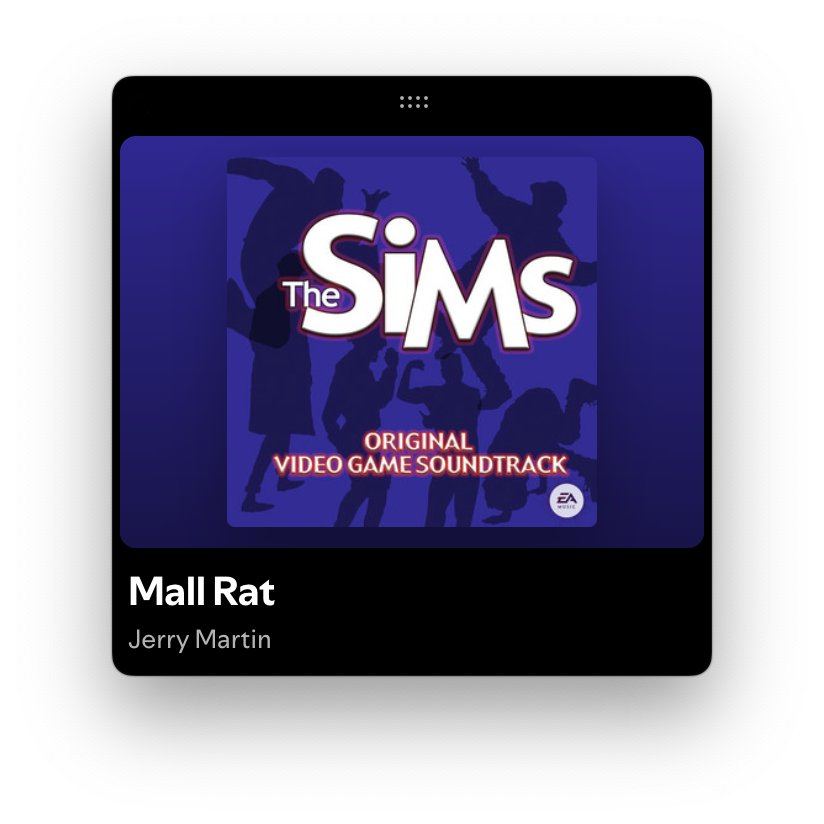

  

# Hardware
* Computer: Mac mini M2
* Monitor: Studio Display
* Keyboard: HHKB Hybrid Type-S (Snow / Blank)
* Mouse: Magic Mouse
* Mic: Blue Yeti (Whiteout)
* Chair: Herman Miller Aeron (Mineral / Polished Aluminium)

# Editor
* Editor: VSCode
* Settings & Extensions: ...
* Font: San Francisco Mono
* Theme: Halftone Theme
* File Icon Theme: Chalice
* Product Icon Theme: Carbon

# Software
* Notes: Bear
* To-Do: Apple Reminders
* Terminal: Apple Terminal
* Design: Figma
* Git Client: Fork
